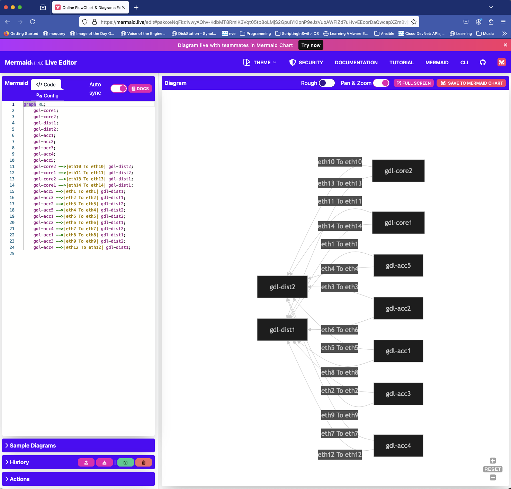

# ContainerLab Topology Mini Project


---
This mini project pulls LLDP based topology information for a namespace (location) from SusieQ via REST and manipulates the data in order to generate a simple Containerlab topology.

The REST call is the equivalent of the CLI command below.

```bash
suzieq> topology show via="lldp" namespace=GDL_Campus
```

Usage:

```bash
(venv) claudia@Claudias-MacBook-Air 05_ClabTopology % python gen_clab_topo.py -h
usage: gen_clab_topo.py [-h] [-g] [-n NAMESPACE] [-l]

Script Description

options:
  -h, --help            show this help message and exit
  -g, --graph           Graph the topology in Mermaid Live Editor. Default: False (do not graph)
  -n NAMESPACE, --namespace NAMESPACE
                        Defines the namespace from which to pull topology data from SuzieQ. Default: 'GDL_Campus'
  -l, --local           Use local data file. Default: False

Usage: ' python gen_clab_topo.py'


```


### Default Use

In the default execution, the script executes a REST call to the SuzieQ server to obtain LLDP topology information for the default namespace `GDL_Campus`.  This must be a valid namespace configured on the SuzieQ server.  The result is a containerlab topology file.  

```% python gen_clab_topo.py   
% python gen_clab_topo.py   
JSON payload has been saved to topology_data.json

Containerlab Topology file saved to gdl_campus_topology.clab.yml in current working directory.
```

Deploying the resulting topology in Containerlab.

```bash
claudia@ubuntu:~/containerlabs/gdl_campus_topology$ sudo clab deploy --reconfigure
[sudo] password for claudia:
INFO[0000] Containerlab v0.59.0 started
INFO[0000] Parsing & checking topology file: gdl_campus_topology.clab.yml
INFO[0000] Destroying lab: gdl_campus_topology
INFO[0000] Removed container: clab-gdl_campus_topology-gdl-acc3
INFO[0000] Removed container: clab-gdl_campus_topology-gdl-core2
INFO[0000] Removed container: clab-gdl_campus_topology-gdl-dist2
INFO[0000] Removed container: clab-gdl_campus_topology-gdl-acc4
INFO[0000] Removed container: clab-gdl_campus_topology-gdl-core1
INFO[0000] Removed container: clab-gdl_campus_topology-gdl-acc2
INFO[0000] Removed container: clab-gdl_campus_topology-gdl-acc5
INFO[0000] Removed container: clab-gdl_campus_topology-gdl-dist1
INFO[0000] Removing containerlab host entries from /etc/hosts file
INFO[0000] Removing ssh config for containerlab nodes
INFO[0000] Removing /home/claudia/containerlabs/gdl_campus_topology/clab-gdl_campus_topology directory...
INFO[0000] Creating lab directory: /home/claudia/containerlabs/gdl_campus_topology/clab-gdl_campus_topology
INFO[0000] Creating container: "gdl-acc2"
INFO[0000] Creating container: "gdl-dist1"
INFO[0000] Creating container: "gdl-acc4"
INFO[0000] Creating container: "gdl-acc5"
INFO[0000] Creating container: "gdl-core1"
INFO[0000] Creating container: "gdl-core2"
INFO[0000] Creating container: "gdl-acc1"
INFO[0000] Creating container: "gdl-dist2"
INFO[0003] Running postdeploy actions for Arista cEOS 'gdl-acc2' node
INFO[0004] Running postdeploy actions for Arista cEOS 'gdl-acc5' node
INFO[0004] Created link: gdl-core2:eth6 <--> gdl-dist2:eth6
INFO[0004] Running postdeploy actions for Arista cEOS 'gdl-core2' node
INFO[0004] Created link: gdl-acc5:eth8 <--> gdl-dist2:eth8
INFO[0005] Created link: gdl-acc2:eth11 <--> gdl-dist2:eth11
INFO[0005] Running postdeploy actions for Arista cEOS 'gdl-acc4' node
INFO[0005] Created link: gdl-acc4:eth12 <--> gdl-dist2:eth12
INFO[0005] Running postdeploy actions for Arista cEOS 'gdl-core1' node
INFO[0006] Created link: gdl-core1:eth13 <--> gdl-dist2:eth13
INFO[0006] Running postdeploy actions for Arista cEOS 'gdl-dist2' node
INFO[0007] Created link: gdl-core2:eth2 <--> gdl-dist1:eth2
INFO[0007] Created link: gdl-acc1:eth4 <--> gdl-dist2:eth4
INFO[0007] Running postdeploy actions for Arista cEOS 'gdl-acc1' node
INFO[0007] Created link: gdl-acc1:eth3 <--> gdl-dist1:eth3
INFO[0007] Created link: gdl-acc2:eth7 <--> gdl-dist1:eth7
INFO[0007] Created link: gdl-acc4:eth9 <--> gdl-dist1:eth9
INFO[0007] Created link: gdl-core1:eth10 <--> gdl-dist1:eth10
INFO[0007] Created link: gdl-acc5:eth14 <--> gdl-dist1:eth14
INFO[0007] Running postdeploy actions for Arista cEOS 'gdl-dist1' node
INFO[0102] Creating container: "gdl-acc3"
INFO[0103] Created link: gdl-acc3:eth1 <--> gdl-dist1:eth1
INFO[0103] Created link: gdl-acc3:eth5 <--> gdl-dist2:eth5
INFO[0103] Running postdeploy actions for Arista cEOS 'gdl-acc3' node
INFO[0137] Adding containerlab host entries to /etc/hosts file
INFO[0137] Adding ssh config for containerlab nodes
+---+------------------------------------+--------------+-------------+------+---------+-----------------+----------------------+
| # |                Name                | Container ID |    Image    | Kind |  State  |  IPv4 Address   |     IPv6 Address     |
+---+------------------------------------+--------------+-------------+------+---------+-----------------+----------------------+
| 1 | clab-gdl_campus_topology-gdl-acc1  | 79b16bd48fbc | ceos:latest | ceos | running | 172.20.20.13/24 | 2001:172:20:20::d/64 |
| 2 | clab-gdl_campus_topology-gdl-acc2  | 875db099b62d | ceos:latest | ceos | running | 172.20.20.8/24  | 2001:172:20:20::8/64 |
| 3 | clab-gdl_campus_topology-gdl-acc3  | 41abe834720d | ceos:latest | ceos | running | 172.20.20.15/24 | 2001:172:20:20::f/64 |
| 4 | clab-gdl_campus_topology-gdl-acc4  | 50373a606bb2 | ceos:latest | ceos | running | 172.20.20.11/24 | 2001:172:20:20::b/64 |
| 5 | clab-gdl_campus_topology-gdl-acc5  | e02ce9cf99c8 | ceos:latest | ceos | running | 172.20.20.10/24 | 2001:172:20:20::a/64 |
| 6 | clab-gdl_campus_topology-gdl-core1 | 1779b560e6ee | ceos:latest | ceos | running | 172.20.20.12/24 | 2001:172:20:20::c/64 |
| 7 | clab-gdl_campus_topology-gdl-core2 | e7c945d2df68 | ceos:latest | ceos | running | 172.20.20.9/24  | 2001:172:20:20::9/64 |
| 8 | clab-gdl_campus_topology-gdl-dist1 | 2ffde0a3f9c2 | ceos:latest | ceos | running | 172.20.20.14/24 | 2001:172:20:20::e/64 |
| 9 | clab-gdl_campus_topology-gdl-dist2 | afc9d7e4c294 | ceos:latest | ceos | running | 172.20.20.7/24  | 2001:172:20:20::7/64 |
+---+------------------------------------+--------------+-------------+------+---------+-----------------+----------------------+
claudia@ubuntu:~/containerlabs/a2-test1$ ^C
```


### Graph Topology

Using the -g or --graph option will generate a toplogy view of the resulting containerlab topology in Mermaid Live Editor.

```bash
% python gen_clab_topo.py -g
JSON payload has been saved to topology_data.json

Containerlab Topology file saved to gdl_campus_topology.clab.yml in current working directory.

(venv-ac2jinja) claudiadeluna in ~/Indigo Wire Networks Dropbox/Claudia de Luna/scripts/python/2024/ac2_templating_workshop/05_ClabTopology on main
% 
```

The script with the -g option will open the default browser on your system and display the diagram.

Note:  DuckDuckGo browser does not render.




---

### Modules

- jinja2
- python-dotenv (load the SuzieQ REST API Token)
- requests (make calls to SuzieQ REST API and to Mermaid Live Editor)


---

### Alternatives

Need local LLDP topology