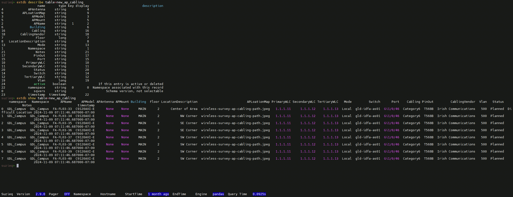
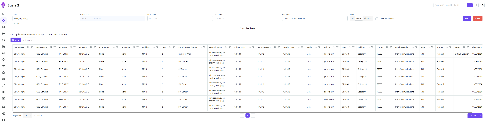

# Statement of Work for New Access Point Cabling

 

This mini project generates a Statement of Work suitable for quote solicitation for new cabling to support new Access Point locations at a site.

A challenge all Network Engineers face is that of storing design or change data in a queriable way.

SuzieQ Enterprise supports the integration of external data.  In this mini project we have data for new access point cabling runs in an SuzieQ External DB.  Once this external data is imported, the familiar methods, syntax, and interfaces used for other SuzieQ interactions can be used on this data.  It can also be updated over time, so updates can be tracked!

Imagine a world where, when asked "How many new runs did we need at GDL?"
Everyone answers 8!

Rather than Little Joey answering 7 because he had an old version of the "design" file and Little Suzie answer 8 because she had the updated version and then everyone having to go figure out which is correct.

Using this feature, we will extract the latest new cabling data from the SuzieQ External DB `new_ap_cabling` and generate a detailed Statement of Work for a location.


---


## SuzieQ Enterprise External DB






```bash
suzieq@customvm:~$ cd extdb_import_staging/
suzieq@customvm:~/extdb_import_staging$ ls
cleanup_critical_vlans.py  cleanup_new_ap_runs.py  gdl_new_ap_cabling.csv
suzieq@customvm:~/extdb_import_staging$ sq-import-data -i /home/suzieq/extdb_import_staging/gdl_new_ap_cabling.csv -t new_ap_cabling -n GDL_Campus -k 'APName' -c /home/suzieq/.suzieq/suzieq-cfg.yml -w /home/suzieq/extdb_import_staging/cleanup_new_ap_runs.py
Successfully imported file: /home/suzieq/extdb_import_staging/gdl_new_ap_cabling.csv with 8 rows and 23 columns in 0.1886s secs
suzieq@customvm:~/extdb_import_staging$
```


##### Example File and Schema

```csv

suzieq@customvm:~/extdb_import_staging$ cat gdl_new_ap_cabling.csv
Namespace,APName,APModel,APAntenna,APMount,Building,Floor,LocationDescription,APLoationMap,PrimaryWLC,SecondaryWLC,TertiaryWLC,Mode,Switch,Port,Cabling,PinOut,CablingVendor,Vlan,Status,Notes
GDL_Campus,FA-FL03-33,C9120AXI-E,None,None,MAIN,2,Center of Area,wireless-survey-ap-cabling-path.jpeg,1.1.1.11,1.1.1.12,1.1.1.13,Local,gld-idfa-as01,Gi1/0/46,Category6,T568B,Irish Communications,500
GDL_Campus,FA-FL03-34,C9120AXI-E,None,None,MAIN,2,NW Corner,wireless-survey-ap-cabling-path.jpeg,1.1.1.11,1.1.1.12,1.1.1.13,Local,gld-idfa-as01,Gi1/0/46,Category6,T568B,Irish Communications,500
GDL_Campus,FA-FL03-35,C9120AXI-E,None,None,MAIN,2,SE Corner,wireless-survey-ap-cabling-path.jpeg,1.1.1.11,1.1.1.12,1.1.1.13,Local,gld-idfa-as01,Gi1/0/46,Category6,T568B,Irish Communications,500
GDL_Campus,FA-FL03-36,C9120AXI-E,None,None,MAIN,2,SE Corner,wireless-survey-ap-cabling-path.jpeg,1.1.1.11,1.1.1.12,1.1.1.13,Local,gld-idfa-as01,Gi1/0/46,Category6,T568B,Irish Communications,500
GDL_Campus,FA-FL03-37,C9120AXI-E,None,None,MAIN,2,SW Corner,wireless-survey-ap-cabling-path.jpeg,1.1.1.11,1.1.1.12,1.1.1.13,Local,gld-idfa-as01,Gi1/0/46,Category6,T568B,Irish Communications,500
GDL_Campus,FA-FL03-38,C9120AXI-E,None,None,MAIN,2,SW Corner,wireless-survey-ap-cabling-path.jpeg,1.1.1.11,1.1.1.12,1.1.1.13,Local,gld-idfa-as01,Gi1/0/46,Category6,T568B,Irish Communications,500
GDL_Campus,FA-FL03-39,C9120AXI-E,None,None,MAIN,2,SW Corner,wireless-survey-ap-cabling-path.jpeg,1.1.1.11,1.1.1.12,1.1.1.13,Local,gld-idfa-as01,Gi1/0/46,Category6,T568B,Irish Communications,500
GDL_Campus,FA-FL03-40,C9120AXI-E,None,None,MAIN,2,SW Corner,wireless-survey-ap-cabling-path.jpeg,1.1.1.11,1.1.1.12,1.1.1.13,Local,gld-idfa-as01,Gi1/0/46,Category6,T568B,Irish Communications,500

```


---

## Modules

